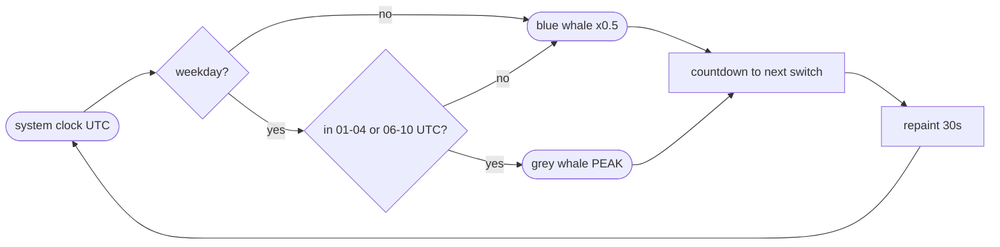

# 🐳 DeepSeek Whale — DeepSeek Off-Peak Pricing Indicator for Hermes Agent Desktop

[](LICENSE) [](https://github.com/NousResearch/hermes-agent)

A live [DeepSeek API](https://api-docs.deepseek.com/quick_start/pricing) pricing indicator for the [Hermes Agent](https://github.com/NousResearch/hermes-agent) desktop app. A whale in the titlebar tells you at a glance whether DeepSeek is in **peak hours (full price)** or **off-peak hours (half-price discount)**, so you never burn full-price tokens by accident.

- 🔵 **Off-peak = half price** — full-color blue whale with `x0.5`
- ⚪ **Peak = full price** — greyed-out whale with `PEAK`

Click the whale (or hover) for a live countdown to the next pricing switch. Repaints every 30 seconds. No backend, no API key — pure clock math against DeepSeek's fixed UTC peak windows (01:00–04:00 and 06:00–10:00 UTC, Monday–Friday excluding Chinese public holidays; weekends and holidays always off-peak).

Also answers to Ctrl+K → `DeepSeek Whale: peak status`.

## Why this exists

DeepSeek charges full price during peak hours and ~50% off during off-peak hours. That pricing question — *"am I in peak right now?"* — deserves an answer without opening a browser tab. This plugin puts it in the Hermes desktop titlebar, next to the settings gear.

Peak hours per [DeepSeek's pricing page](https://api-docs.deepseek.com/quick_start/pricing): 01:00–04:00 and 06:00–10:00 UTC, Monday through Friday, excluding Chinese public holidays. All other hours are off-peak, including full weekends and Chinese public holidays in full.

Note: the plugin is pure clock math with no holiday calendar, so on a Chinese public holiday that falls on a weekday it will still show peak — when in doubt, check the pricing page.

## How it works



- Reads your system clock, converts to UTC, and checks it against the two weekday peak windows.
- Weekends always read off-peak. The countdown sweeps forward to the next rate switch, so Friday evening correctly counts down to Monday 01:00 UTC.
- Zero network calls, zero config, zero API keys. It never touches your requests — it only makes the cheap hours visible.

## Install (Hermes desktop plugin)

Copy `desktop/plugin.js` into your Hermes home:

```
$HERMES_HOME/desktop-plugins/deepseek-whale/plugin.js
```

(folder name must equal the plugin `id`, which is `deepseek-whale`). Then in the desktop app: Ctrl+K → **Reload desktop plugins**. Toggle it in Settings → Plugins.

Requires the Hermes desktop app (`hermes desktop`). Built on the [@hermes/plugin-sdk](https://hermes-agent.nousresearch.com/docs/developer-guide/desktop-plugin-sdk) titlebar contribution area — single ESM file, no build step.

## FAQ

**When are DeepSeek off-peak hours?**
Every hour outside 01:00–04:00 and 06:00–10:00 UTC, Monday–Friday — plus full weekends and Chinese public holidays. Off-peak tokens cost half the peak rate.

**Does the whale work on weekends?**
Yes — and it stays blue all weekend, since weekends are always off-peak.

**Does it send any data anywhere?**
No. It reads your clock and does arithmetic locally. Nothing leaves your machine.

## Retune the windows

If DeepSeek changes its peak schedule, edit `PEAK_WINDOWS` at the top of `desktop/plugin.js`:

```js
// [startHour, endHour) in UTC
const PEAK_WINDOWS = [[1, 4], [6, 10]]
```

## Keywords

deepseek, deepseek-api, peak-hours, off-peak, api-pricing, cost-optimization, hermes-agent, desktop-plugin, titlebar-widget, llm-pricing

## License

MIT — see [LICENSE](LICENSE).
